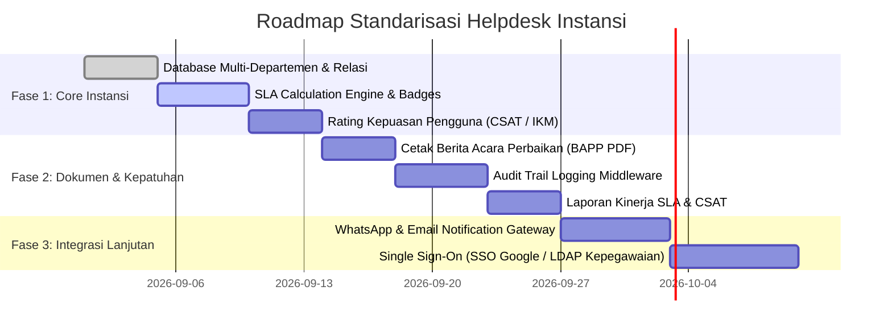

# 🏛️ Standarisasi & Roadmap Helpdesk Instansi (Backend & Frontend)

Dokumen ini memuat panduan komprehensif mengenai **standarisasi tata kelola IT (ITIL / ISO 20000 / SPBE)**, rancangan arsitektur, serta spesifikasi teknis untuk pengembangan **Backend (Laravel API)** dan **Frontend (Vue 3 / Vite)** agar sistem **NexTix** siap diterapkan pada lingkungan instansi pemerintah, BUMN, maupun korporasi berskala besar.

---

## 📑 Daftar Isi
1. [Standarisasi Tata Kelola IT (Governance & Compliance)](#1-standarisasi-tata-kelola-it)
2. [Arsitektur & Spesifikasi Backend (Laravel API)](#2-arsitektur--spesifikasi-backend-laravel-api)
   - [A. Struktur Database & Relasi](#a-struktur-database--relasi)
   - [B. Spesifikasi Endpoint API](#b-spesifikasi-endpoint-api)
   - [C. Mekanisme SLA & Auto-Escalation Engine](#c-mekanisme-sla--auto-escalation-engine)
   - [D. Audit Trail & Activity Logging](#d-audit-trail--activity-logging)
   - [E. Layanan Notifikasi (WhatsApp / Email Gateway)](#e-layanan-notifikasi-whatsapp--email-gateway)
3. [Arsitektur & Spesifikasi Frontend (Vue 3 + Pinia + Tailwind)](#3-arsitektur--spesifikasi-frontend-vue-3)
   - [A. Manajemen State Pinia Baru](#a-manajemen-state-pinia-baru)
   - [B. Komponen & Halaman Baru](#b-komponen--halaman-baru)
   - [C. UI/UX SLA Timer & Rating CSAT](#c-uiux-sla-timer--rating-csat)
   - [D. Ekspor Berita Acara Perbaikan (BAP) PDF](#d-ekspor-berita-acara-perbaikan-bap-pdf)
4. [Tahapan Implementasi (Roadmap Pengembangan)](#4-tahapan-implementasi-roadmap-pengembangan)

---

## 1. Standarisasi Tata Kelola IT

Untuk memenuhi standar instansi formal, Helpdesk mengadopsi 4 pilar utama:

| Standar / Regulasi | Deskripsi & Implementasi pada Sistem |
| :--- | :--- |
| **ITIL 4 / ISO 20000 (ITSM)** | Klasifikasi tiket menjadi 3 jenis: <br>• **Incident**: Gangguan/kerusakan layanan (printer mati, internet putus).<br>• **Service Request**: Permintaan layanan standar (instalasi OS baru, permohonan akun email dinas).<br>• **Change Request**: Perubahan konfigurasi server/jaringan. |
| **SPBE (Sistem Pemerintahan Berbasis Elektronik)** | • Kepatuhan audit (*Audit Trail* mencatat setiap perubahan data).<br>• Interoperabilitas via REST API terstandarisasi JSON.<br>• Keamanan otentikasi berbasis JWT / SSO Kepegawaian. |
| **SLA (Service Level Agreement)** | Perhitungan otomatis **Target Respon Awal** (*Response Time*) dan **Target Penyelesaian** (*Resolution Time*) dengan status SLA: `On Time`, `Near Breach`, dan `Breached`. |
| **Indeks Kepuasan Pengguna (IKM / CSAT)** | Survei kepuasan 5 skala bintang + ulasan kualitas layanan setelah tiket diselesaikan untuk Key Performance Indicator (KPI) teknisi bulanan. |

---

## 2. Arsitektur & Spesifikasi Backend (Laravel API)

### A. Struktur Database & Relasi

#### 1. Tabel `departments` (Unit Kerja / Bidang / OPD)
```sql
CREATE TABLE departments (
    id BIGINT PRIMARY KEY AUTO_INCREMENT,
    name VARCHAR(150) NOT NULL,
    code VARCHAR(50) UNIQUE NOT NULL, -- Contoh: 'TIK', 'KEU', 'SETDA'
    description TEXT NULL,
    is_active BOOLEAN DEFAULT TRUE,
    created_at TIMESTAMP NULL,
    updated_at TIMESTAMP NULL
);
```

#### 2. Tabel `sla_policies` (Konfigurasi Waktu Tanggap & Solusi)
```sql
CREATE TABLE sla_policies (
    id BIGINT PRIMARY KEY AUTO_INCREMENT,
    priority VARCHAR(50) NOT NULL, -- 'Critical', 'Major', 'Normal', 'Minor'
    response_time_minutes INT NOT NULL, -- misal 30 menit
    resolution_time_minutes INT NOT NULL, -- misal 240 menit (4 jam)
    is_active BOOLEAN DEFAULT TRUE,
    created_at TIMESTAMP NULL,
    updated_at TIMESTAMP NULL
);
```

#### 3. Modifikasi Tabel `tickets` (Penambahan Kolom Instansi)
```sql
ALTER TABLE tickets ADD COLUMN ticket_type ENUM('incident', 'service_request', 'change_request') DEFAULT 'incident';
ALTER TABLE tickets ADD COLUMN department_id BIGINT NULL REFERENCES departments(id);
ALTER TABLE tickets ADD COLUMN response_due_at TIMESTAMP NULL;
ALTER TABLE tickets ADD COLUMN resolution_due_at TIMESTAMP NULL;
ALTER TABLE tickets ADD COLUMN first_responded_at TIMESTAMP NULL;
ALTER TABLE tickets ADD COLUMN resolved_at TIMESTAMP NULL;
ALTER TABLE tickets ADD COLUMN is_sla_breached BOOLEAN DEFAULT FALSE;
```

#### 4. Tabel `ticket_ratings` (Survei Kepuasan / CSAT)
```sql
CREATE TABLE ticket_ratings (
    id BIGINT PRIMARY KEY AUTO_INCREMENT,
    ticket_id BIGINT UNIQUE NOT NULL REFERENCES tickets(id) ON DELETE CASCADE,
    user_id BIGINT NOT NULL REFERENCES users(id),
    rating INT NOT NULL CHECK (rating BETWEEN 1 AND 5),
    feedback TEXT NULL,
    created_at TIMESTAMP NULL,
    updated_at TIMESTAMP NULL
);
```

#### 5. Tabel `audit_logs` (Rekam Jejak Kepatuhan Audit)
```sql
CREATE TABLE audit_logs (
    id BIGINT PRIMARY KEY AUTO_INCREMENT,
    user_id BIGINT NULL REFERENCES users(id),
    action VARCHAR(100) NOT NULL, -- 'STATUS_CHANGED', 'TICKET_ASSIGNED', 'FILE_DELETED'
    entity_type VARCHAR(100) NOT NULL, -- 'Ticket', 'User', 'Kategori'
    entity_id BIGINT NOT NULL,
    old_values JSON NULL,
    new_values JSON NULL,
    ip_address VARCHAR(45) NULL,
    user_agent TEXT NULL,
    created_at TIMESTAMP DEFAULT CURRENT_TIMESTAMP
);
```

---

### B. Spesifikasi Endpoint API

#### 1. SLA & Rating
- `POST /api/auth/tickets/{id}/rate` : Mengirim rating kepuasan (1-5 bintang + komentar).
- `GET /api/auth/tickets/sla-stats` : Ringkasan performa SLA (SLA Met vs SLA Breached).
- `GET /api/auth/report/csat` : Laporan Indeks Kepuasan Masyarakat / Pengguna.

#### 2. Unit Kerja / Departemen
- `GET /api/auth/departments` : Mendapatkan daftar seluruh departemen/unit kerja.
- `POST /api/auth/departments` : Menambah departemen (Admin only).
- `PUT /api/auth/departments/{id}` : Mengubah data departemen.

#### 3. Berita Acara Perbaikan (BAP) PDF
- `GET /api/auth/tickets/{id}/export-bap` : Menghasilkan lembar resmi Berita Acara Penyelesaian Pekerjaan (BAPP) PDF lengkap dengan nomor surat otomatis, spesifikasi kendala, tindakan teknisi, dan kolom tanda tangan pelapor & teknisi.

---

### C. Mekanisme SLA & Auto-Escalation Engine

Buat Laravel Scheduled Command (`php artisan sla:check`) yang dijalankan setiap 5 menit:
```php
// app/Console/Commands/CheckSlaBreach.php
public function handle()
{
    $now = now();

    // 1. Cek tiket yang terlambat direspon
    $unrespondedTickets = Ticket::where('status', 'open')
        ->where('response_due_at', '<', $now)
        ->whereNull('first_responded_at')
        ->get();

    foreach ($unrespondedTickets as $ticket) {
        $ticket->update(['is_sla_breached' => true]);
        // Trigger Event Notifikasi Eskalasi ke Supervisor
        event(new TicketSlaBreachedEvent($ticket, 'response_breach'));
    }

    // 2. Cek tiket yang terlambat diselesaikan
    $unresolvedTickets = Ticket::whereIn('status', ['open', 'in_progress'])
        ->where('resolution_due_at', '<', $now)
        ->whereNull('resolved_at')
        ->get();

    foreach ($unresolvedTickets as $ticket) {
        $ticket->update(['is_sla_breached' => true]);
        event(new TicketSlaBreachedEvent($ticket, 'resolution_breach'));
    }
}
```

---

### D. Layanan Notifikasi (WhatsApp & Email Gateway)

Kirim notifikasi otomatis pada event-event berikut:
1. **Tiket Baru Terbit** $\rightarrow$ WhatsApp ke Teknisi & Email Bukti Pengajuan ke Pelapor.
2. **Komentar / Respon Teknisi** $\rightarrow$ WhatsApp / Email ke Pelapor.
3. **Tiket Selesai (Closed)** $\rightarrow$ WhatsApp link pengisian rating kepuasan ke Pelapor.

```php
// app/Services/WhatsAppService.php
public function sendNotification(string $targetPhone, string $message)
{
    // Integrasi ke provider WA Gateway (Fonnte / Wablas / Twilio)
    Http::withHeaders([
        'Authorization' => config('services.whatsapp.api_key'),
    ])->post(config('services.whatsapp.endpoint'), [
        'target' => $targetPhone,
        'message' => $message,
    ]);
}
```

---

## 3. Arsitektur & Spesifikasi Frontend (Vue 3)

### A. Manajemen State Pinia Baru

#### 1. `src/stores/departmentStore.ts`
- Menyimpan daftar departemen/unit kerja aktif untuk dropdown di form buat tiket & registrasi user.

#### 2. `src/stores/ratingStore.ts`
- Mengirim feedback dan rating kepuasan bintang 1-5.

---

### B. Komponen & Halaman Baru

| Komponen / View | Lokasi File | Fungsi |
| :--- | :--- | :--- |
| `SlaBadge.vue` | `src/components/SlaBadge.vue` | Menampilkan countdown SLA sisa waktu (hijau jika aman, merah jika breached). |
| `RatingModal.vue` | `src/components/RatingModal.vue` | Dialog popup rating kepuasan bintang 1-5 yang otomatis muncul setelah tiket diselesaikan. |
| `DepartmentView.vue` | `src/views/admin/DepartmentView.vue` | Manajemen Unit Kerja / Bidang untuk instansi. |
| `CsatReportView.vue` | `src/views/admin/CsatReportView.vue` | Laporan Indeks Kepuasan Pengguna (IKM) & kinerja teknisi. |

---

### C. UI/UX SLA Timer & Rating CSAT

1. **SLA Countdown Timer** di [DetailTicketView.vue](file:///c:/Users/Indruyy/Documents/codingan/tiketing/NexTix/src/views/ticket/DetailTicketView.vue):
   - Menampilkan batas waktu resolusi tiket (misal: *Sisa 01 jam 45 menit*).
   - Memberi peringatan visual amber/merah jika mendekati batas SLA.

2. **Rating Bintang Interaktif**:
   - 5 Bintang dengan deskripsi (*1 = Sangat Kecewa*, *3 = Cukup*, *5 = Sangat Puas*).
   - Kolom feedback teks opsional untuk evaluasi teknisi.

---

### D. Ekspor Berita Acara Perbaikan (BAP) PDF

Di [DetailTicketView.vue](file:///c:/Users/Indruyy/Documents/codingan/tiketing/NexTix/src/views/ticket/DetailTicketView.vue), tambahkan tombol:
```html
<button 
  v-if="ticket.status === 'closed'"
  @click="downloadBAP(ticket.id_ticket)"
  class="px-4 py-2 bg-slate-800 text-white rounded-xl font-bold text-xs flex items-center gap-2"
>
  <font-awesome-icon icon="fa-solid fa-file-signature" />
  <span>Cetak Berita Acara (BAPP)</span>
</button>
```

---

## 4. Tahapan Implementasi (Roadmap Pengembangan)



---

## 📌 Ringkasan Nilai Jual untuk Instansi

Dengan mengimplementasikan standar di atas, NexTix siap menjadi **Sistem Manajemen Layanan IT Resmi** dengan nilai keunggulan:
1. **Transparansi SLA**: Pimpinan instansi dapat memantau apakah tim IT merespon kendala sesuai target waktu.
2. **Kepatuhan Audit (SPBE / BPK / Inspektorat)**: Seluruh riwayat tiket, lampiran, dan tindakan teknisi tercatat secara digital tanpa celah manipulasi.
3. **Akuntabilitas Kinerja**: Nilai kepuasan pelapor (IKM) menjadi metrik kuantitatif penilaian kinerja unit IT.
4. **Resmi & Terverifikasi**: Memiliki dokumen Berita Acara Perbaikan (BAPP) standar instansi.
